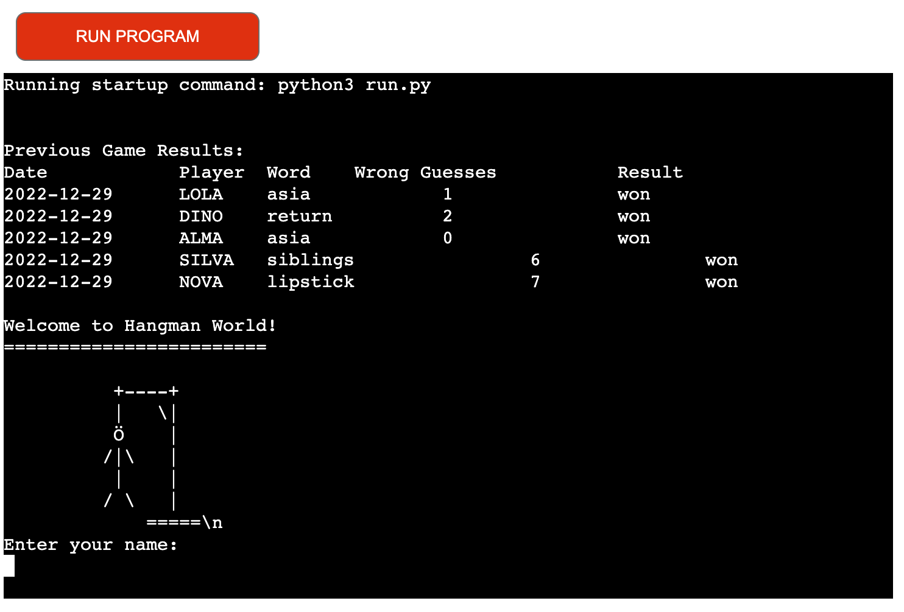
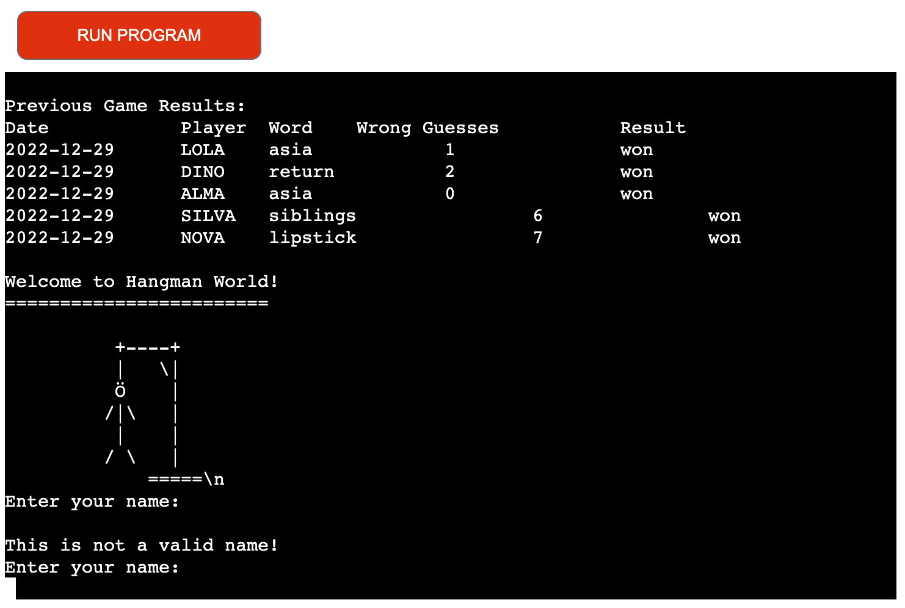
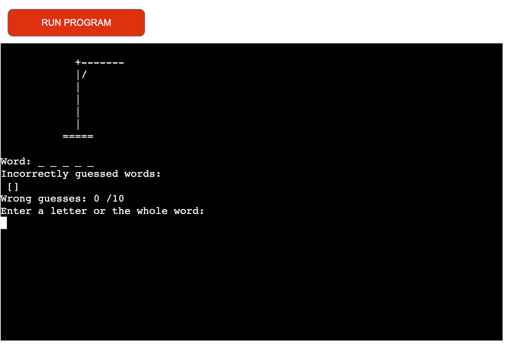
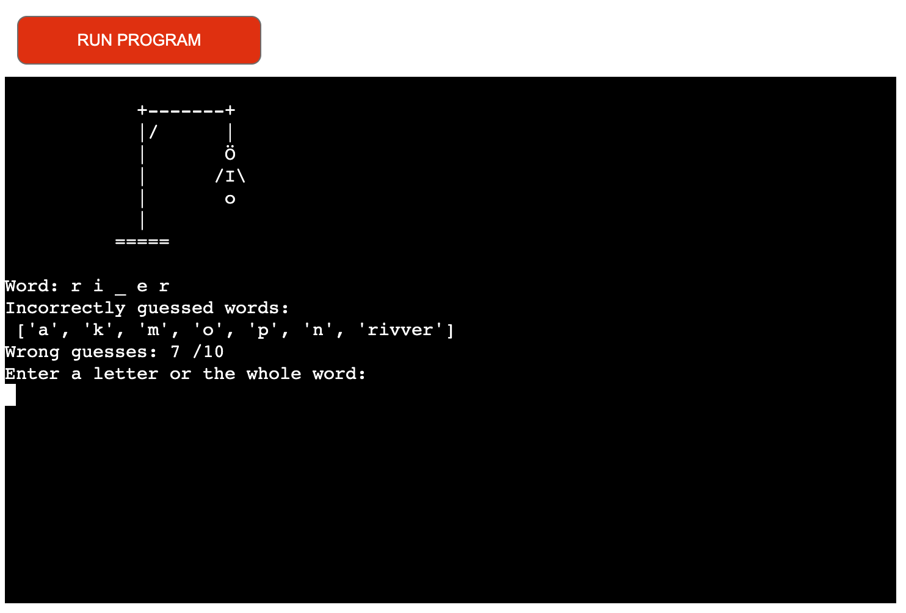
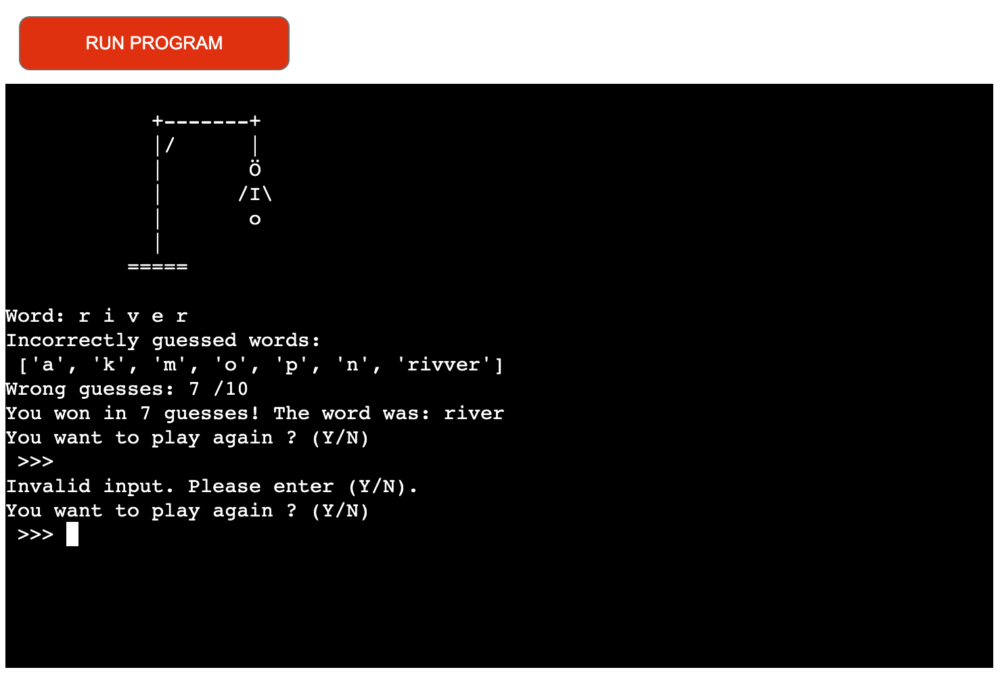
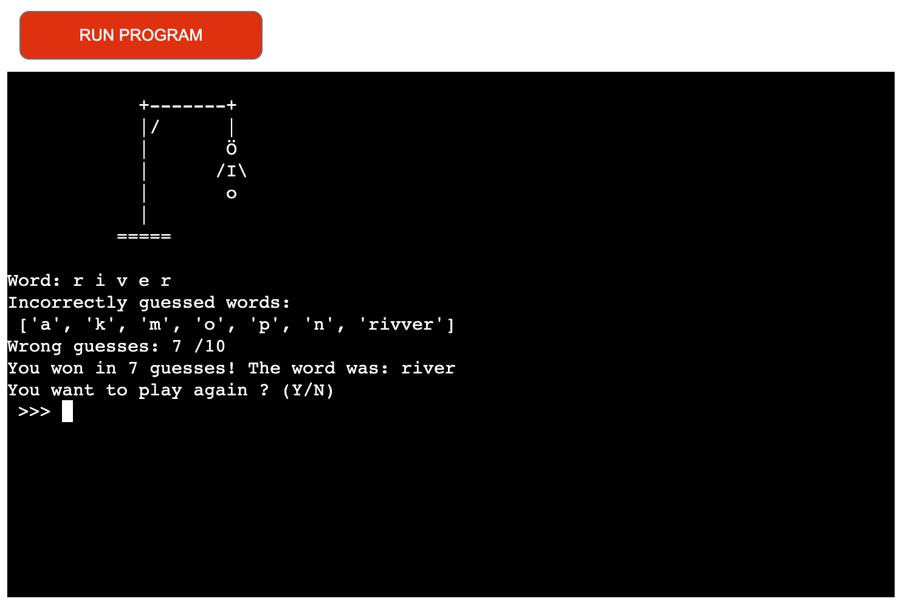
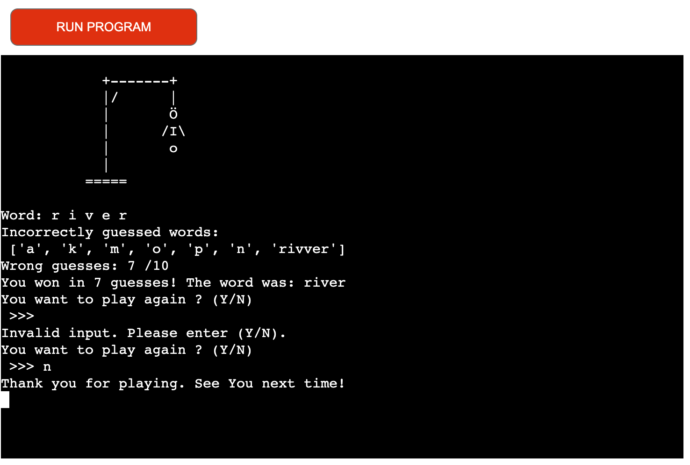
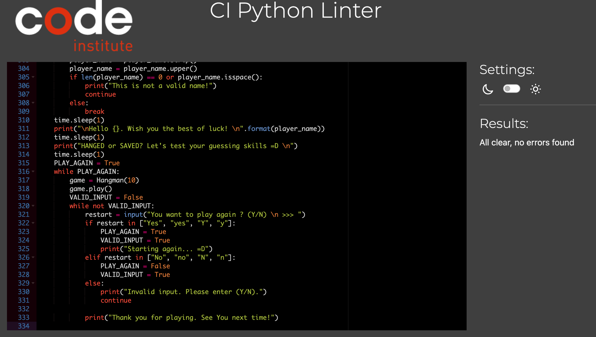
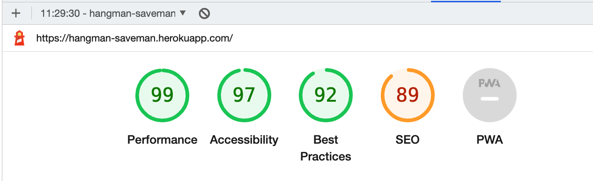

# PP3 Python - Hangman_Game

My Hangman game is based on logic: one player at the time. It's a Python terminal game, which runs in the mock terminal created by Code Institute and is deployed on Heroku. My game contains functions to check if the user input is valid, to avoid any kind of confusion in the game flow. The player can guess only one letter at the time or, if lucky, the whole word. If case the guessed a letter is a duplicate or triplicate, all the empty blanks will be fill-in or in case of repeated guess a warning message will pop-up in the mock terminal. Once the max number of attempts is reached and the player fails to guess the word, then the game is lost and it's a game over.

The goal of this project is to put together everything I have learned throughout the past month. Combined from, Python Essential modules by CI and the things my mentor has showed me, this project is a demonstration of my knowledge acquired throughout the Python course and 'Love Sandwiches' walkthrough project.

## Live Site

You can view the live deployed game here: [Hangman_Game](https://hangman-saveman.herokuapp.com/)

# Contents

* [Objective](<#objective>)
* [User Experience](<#user-experience-ux>)
* [Hangman Flow Chart](<#hangman-flow-chart>)
* [Features](#features)
* [Future Features](<#future-features>)
* [Technologies Used](#technologies-used)
* [Testing](<#testing>)
  * [CI Python Linter Valdation](<#ci-python-linter-validation>)
* [Deployment](#deployment)
* [Lighthouse](#lighthouse)
* [Bugs](#bugs)
  * [Known Bugs](#known-bugs)
  * [Solved Bugs](#solved-bugs)
* [Credits](<#credits>)
* [Acknowledgements](<#acknowledgements>)

# Objective

With this project I want to deliver a fully interactive, user friendly fun command line game. 

[Back to content list](<#contents>)

# User Experience (UX)

### __User Stories__
- The player wants to feel welcome to play.
- The Player wants to be able to input their name and receive a feedback if the data is invalid.
- The Player wants to know the number of attempts in total and attempts left.
- The Player wants to know the already guessed letters/words and get notified if the letter/word has been already guessed.
- The player wants to have a clear message about the state on the end of the game.
- The player wants to be able to choose if they wanna play further or quit.

[Back to content list](<#contents>)

# Hangman Flow Chart

A flow-chart was used for mapping-out the necessary steps throughout the implementation process of this game. A free sign up with [Lucid Chart](https://www.lucidchart.com/pages/) helped in creation of this map.

[Back to content list](<#contents>)

# Features

My game displays the following features:

- Home Page and the latest five results from the result sheet
- Game Stages
- Exit Game

## Home Page

- The home page displays the latest five results from the hangman_game sheet, the name and ASCII art of the game and welcomes the user.
- User will be asked to input their username to continue and once they hit the ENTER, the player will be greeted bu seeing their name being displayed.

## Game Stages

 - Once the game begins, the user will be able to see all the stages of the game after each attempt, these are:
   * Random word displayed with underscores
   * List of incorrectly guesses letter(s) or word(s)
   * The number of incorrect attemps
   * Error messages if the player makes the wrong selection
   * The option to play again

## Exit Game

[Back to content list](<#contents>)

# Future Features

## Add a list of options (menu) to the game

- This game could have a menu option to offer a player more, such as a choice of picking a language or a difficulty level for the game as well as list of instructions to make it more interactive and more fun.

## Stopwatch or Timer

- This feature would improve the game and add a level of difficulty to it.

[Back to content list](<#contents>)

# Technologies Used

## Languages

- [Python](https://en.wikipedia.org/wiki/Python_(programming_language))

## Programs Used

- [Git](https://git-scm.com/) by utilizing the Gitpod terminal for version control.

- [GitHub](https://github.com/) used to store the project once pushed from Git.

- [Heroku](https://heroku.com/) used for deploying the application.

- [Lucid Chart](https://www.lucidchart.com/) to map the game's flowchart.

- [CI Python Linter](https://pep8ci.herokuapp.com/) to find indentation errors in Python.

[Back to content list](<#contents>)

# Testing

## CI Python Linter Validation

[CI Python Linter](https://pep8ci.herokuapp.com/) online validation was used to check that the code is up to standard. All pages cleared the PEP8 validation with no errors.

## run.py

[Back to content list](<#contents>)

# Bugs Fixed

- While testing the game I discovered I have an error with a function I created to clear the terminal, 

- I fixed this error by adding the correct external import statement > "import sys" to the run.py file.

- When I initially deployed the game to Heroku, my game wouldn't run due to the following error message: 

- I fixed this by adding the external downloaded colorama package to the requirements.txt file.

- I had a few indentation errors in my code, I fixed this by passing my code on PEP8 Validation site, readjusted the alignment there, then copied and paste to code back to my run.py file.

[Back to content list](<#contents>)

# Deployment

## Heroku

- The project was deployed using Code Institute's mock terminal for Heroku.

## Deployment steps

- Log into Heroku (create an account if you don't have one)
- Pick the 'Create new app' option from the dashboard.
- Enter your application name - this name has to be unique - select your region and then click "Create App"
- This will bring you to your project page. From here, click the "Settings" tab and scroll down to Config Vars.
- In the KEY input field, enter "PORT" and in the VALUE input field, enter "8000".
- Click the "Add" button to the right to add the Convig Vars.
- Repeat the same step one more time but this time enter "CREDS" in the KEY and under VALUE copy/paste your credentials from CREDS.JSON file and press "Add".
- On the same page scroll down to the buildpacks section and click "Add Buildpack"
- Add both the Python and node.js buildpacks but make sure that the **Python buildpack is above the node.js one**
- Go back to the tabs at the top of the page and this time select the "Deploy" tab.
- Select Github deployment method.
- Search for your repository name and click the "Connect" button to link your chosen repository
- At the bottom of that page, select your preferred deplyment type; Automatic Deployment or Manual Deployment and wait a few minutes for your project to be deployed.

[Back to content list](<#contents>)

# Lighthouse

For desktop: 

[Back to content list](<#contents>)

# Bugs

### Known bugs

No known bugs detected

### Solved Bugs

I came across a few issues and bugs while creating the script.js but I took the good advice my mentor gave me after the first project and made sure to have enough time to code and play around with this second project. By spending more time on googling and asking for guidance I successfully resolve those.

Some of the bugs I came accross and fixed: 

+ Disabling the target buttons
  + Description: Adding "disabled" attribute in html and corresponding code in js
  + Expected behaviour: By selecting one target number others buttons should be disabled
  + Actual behaviour: But adding the attribute in html all the buttons were disabled
  + Fix: Skip adding attribute in html and achive that behavior from js

+ Dice images
  + Description: Loaded page presenting two randomly picked dice images 
  + Expected behaviour: Every time you hit the rollDice button two random images would be presented on the page
  + Actual behaviour: Loaded page presenting dice images but once the rollDice button was hit the images would disappeare
  + Fix: Declaring tow more variables and combining with the code I already had

+ Functions
  + Description: Calling function 
  + Expected behaviour: Function called on the right place would execute the expected code
  + Actual behaviour: Function called on the wrong place does not execute the expected code or duplicates the expected result
  + Fix: After some guidance and explanation I did connect the puzzle parts

[Back to content list](<#contents>)

# Credits

- Code Institute's 'Love Sandwiches' project, was a nice walkthrough and it has helped me a bit in creating my own game.

- Alumni's old projects has been a good reference for ideas and thoughts for this project portfolio, mainly the projects posted on Linkedin.

- A few online pages and tutorials that inspired the whole idea together:

 * [Python Tutorial: Object Oriented Hangman](https://www.youtube.com/watch?v=GxpwA4_4Gww)
 * [What Does if __name__ == "__main__" Do in Python?](https://realpython.com/if-name-main-python/)
 * [Python Tutorial](https://www.w3schools.com/python/default.asp)
 * [How To Use LucidChart](https://www.youtube.com/watch?v=Ngm7JN_9rtQ)

[Back to content list](<#contents>)

# Acknowledgements

 * The README template provided by Code Institute from "Portfolio Project Scope".
 * Specially grateful to my mentor Antonio Rodriquez, I really appreciate all the help, guidance and patience throughout the mentoring sessions. 

[Back to content list](<#contents>)

-----
Happy coder :)