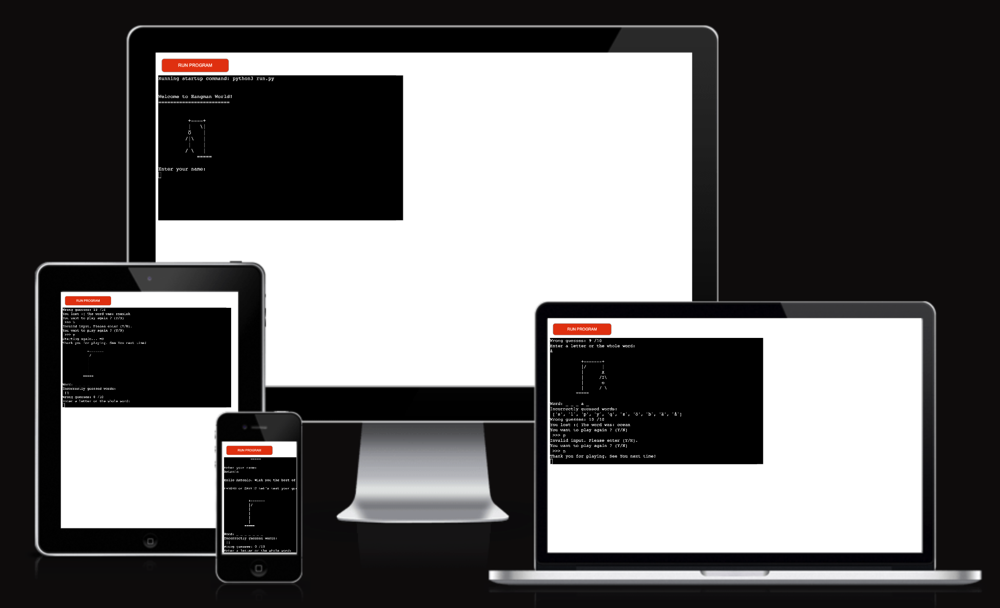
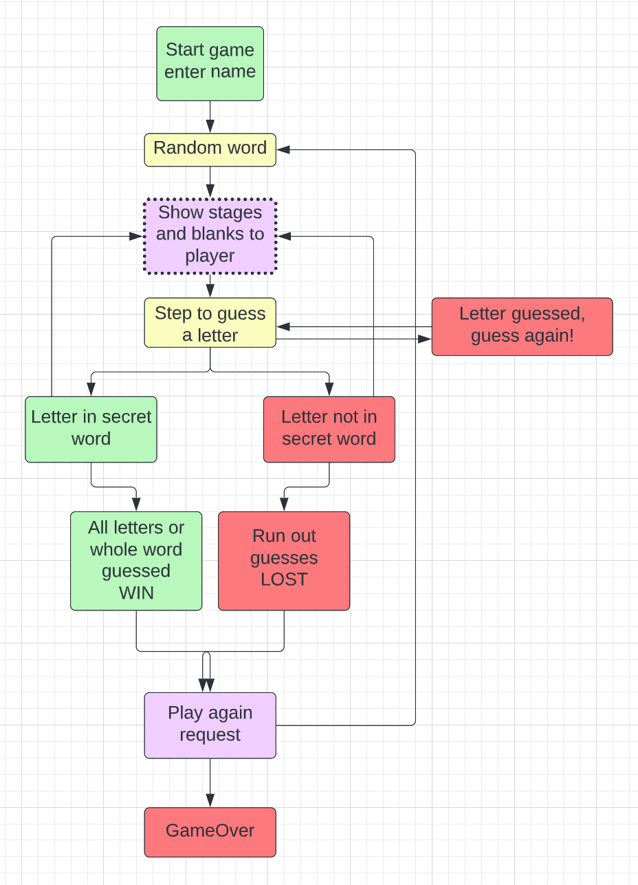

# PP3 Python - Hangman_Game

My Hangman game is based on logic: one player at the time. It's a Python terminal game, which runs in the mock terminal created by Code Institute and is deployed on Heroku. My game contains functions to check if the user input is valid, to avoid any kind of confusion in the game flow. The player can guess only one letter at the time or, if lucky, the whole word. If case the guessed a letter is a duplicate or triplicate, all the empty blanks will be fill-in or in case of repeated guess a warning message will pop-up in the mock terminal. Once the max number of attempts is reached and the player fails to guess the word, then the game is lost and it's a game over.

The goal of this project is to put together everything I have learned throughout the past month. Combined from, Python Essential modules by CI and the things my mentor has showed me, this project is a demonstration of my knowledge acquired throughout the Python course and 'Love Sandwiches' walkthrough project.

## Live Site

You can view the live deployed game here: [Hangman_Game](https://hangman-saveman.herokuapp.com/)

# Contents

* [Objective](<#objective>)
* [User Experience](<#user-experience-ux>)
* [Hangman Flow Chart](<#hangman-flow-chart>)
* [Features](#features)
* [Future Features](<#future-features>)
* [Technologies Used](#technologies-used)
* [Testing](<#testing>)
  * [PEP8 Valdation](<#pep8-validation>)
  * [Bugs Fixed](#bugs-fixed)
* [Deployment](#deployment)
* [Credits](<#credits>)
* [Acknowledgements](<#acknowledgements>)

# Objective

With this project I want to deliver a fully interactive, user friendly fun command line game. 

[Back to content list](<#contents>)

# User Experience (UX)

### __User Stories__
- The Player wants to be able to input their name and receive a feedback if the data is invalid.
- The Player wants to know the number of attempts in total and attempts left.
- The Player wants to know the already guessed letters and get notified if the letter has been already guessed.

- As a user, I want to see if I've made the leaderboard after exiting the game after playing.

[Back to content list](<#contents>)

# Hangman Flow Chart

A flow-chart was used for mapping-out the necessary steps throughout  created with the main purpose to map the steps to follow throughout the implementation process of this game. I signed up for a free account with [Lucid Chart](https://www.lucidchart.com/pages/) to be able to produce the below chart.

[Back to content list](<#contents>)

# Features

My game displays the following features:

- Home Page
- Game Stages
- Exit Game

## Home Page

- The home page displays the name of game, welcomes the user and briefly explains how to play the game.
- Here the user will input his/her name to continue, once done the system will greet the player stating his/her name.

## Game Stages

 - Once the game begins, the user will be able to see all the stages of the game after each attempt, these are:
   * The selected letters
   * The remaining attemps
   * The letters that have been already used
   * Error messages if the player makes the wrong selection
   * The six stages of the hangman
   * The option to play again or be redirected to the main menu

## Exit Game

[Back to content list](<#contents>)

# Future Features

## Add a list of options (menu) to the game

- This game could have a menu option to offer a player more, such as a choice of picking a language or a difficulty level for the game as well as list of instructions to make it more interactive and more fun.

## Stopwatch or Timer

- This feature will definitely add a level of difficulty when the game is played.

[Back to content list](<#contents>)

# Technologies Used

## Languages

- [Python](https://en.wikipedia.org/wiki/Python_(programming_language))

## Programs Used

- [Git](https://git-scm.com/) was used for version control by utilizing the Gitpod terminal to commit to Git and Push to GitHub and Heroku.

- [GitHub](https://github.com/) was used to store the projects code after being pushed from Git.

- [Heroku](https://heroku.com/) was used for the deployed application.

- [Lucid Chart](https://www.lucidchart.com/) to map the flowchart for the game.

- [PEP8 online](http://pep8online.com/checkresult) to find indentation errors in Python.

[Back to content list](<#contents>)

# Testing

## PEP8 Validation

[PEP8](http://pep8online.com/) online validation was used to check that the code is up to standard. All pages cleared the PEP8 validation with no errors.

## run.py

## words.py

[Back to content list](<#contents>)

# Bugs Fixed

- While testing the game I discovered I have an error with a function I created to clear the terminal, 

- I fixed this error by adding the correct external import statement > "import sys" to the run.py file.

- When I initially deployed the game to Heroku, my game wouldn't run due to the following error message: 

- I fixed this by adding the external downloaded colorama package to the requirements.txt file.

- I had a few indentation errors in my code, I fixed this by passing my code on PEP8 Validation site, readjusted the alignment there, then copied and paste to code back to my run.py file.

[Back to content list](<#contents>)

# Deployment

## Heroku

- The project was deployed using Code Institute's mock terminal for Heroku.

## Deployment steps

- Log into Heroku (create an account if you don't have one)
- Pick the 'Create new app' option from the dashboard.
- Enter your application name - this name has to be unique - select your region and then click "Create App"
- This will bring you to your project page. From here, click the "Settings" tab and scroll down to Config Vars.
- In the KEY input field, enter "PORT" and in the VALUE input field, enter "8000".
- Click the "Add" button to the right to add the Convig Vars.
- Repeat the same step one more time but this time enter "CREDS" in the KEY and under VALUE copy/paste your credentials from CREDS.JSON file and press "Add".
- On the same page scroll down to the buildpacks section and click "Add Buildpack"
- Add both the Python and node.js buildpacks but make sure that the **Python buildpack is above the node.js one**
- Go back to the tabs at the top of the page and this time select the "Deploy" tab.
- Select Github deployment method.
- Search for your repository name and click the "Connect" button to link your chosen repository
- At the bottom of that page, select your preferred deplyment type; Automatic Deployment or Manual Deployment and wait a few minutes for your project to be deployed.

[Back to content list](<#contents>)

# Credits

- Code Institute's 'Love Sandwiches' project, was a nice walkthrough and it has helped me a bit in creating my own game.

- Alumni's old projects has been a good reference for ideas and thoughts for this project portfolio, mainly the projects posted on Linkedin.

- A few online pages and tutorials that inspired the whole idea together:

 * [Python Tutorial: Object Oriented Hangman](https://www.youtube.com/watch?v=GxpwA4_4Gww)
 * [What Does if __name__ == "__main__" Do in Python?](https://realpython.com/if-name-main-python/)
 * [Python Tutorial](https://www.w3schools.com/python/default.asp)
 * [How To Use LucidChart](https://www.youtube.com/watch?v=Ngm7JN_9rtQ)

[Back to content list](<#contents>)

# Acknowledgements

 * The README template provided by Code Institute from "Portfolio Project Scope".
 * Specially grateful to my mentor Antonio Rodriquez, I really appreciate all the help, guidance and patience throughout the mentoring sessions. 

[Back to content list](<#contents>)

Welcome Antonio-Claudio Andelic,

This is the Code Institute student template for deploying your third portfolio project, the Python command-line project. The last update to this file was: **August 17, 2021**

## Reminders

* Your code must be placed in the `run.py` file
* Your dependencies must be placed in the `requirements.txt` file
* Do not edit any of the other files or your code may not deploy properly

## Creating the Heroku app

When you create the app, you will need to add two buildpacks from the _Settings_ tab. The ordering is as follows:

1. `heroku/python`
2. `heroku/nodejs`

You must then create a _Config Var_ called `PORT`. Set this to `8000`

If you have credentials, such as in the Love Sandwiches project, you must create another _Config Var_ called `CREDS` and paste the JSON into the value field.

Connect your GitHub repository and deploy as normal.

## Constraints

The deployment terminal is set to 80 columns by 24 rows. That means that each line of text needs to be 80 characters or less otherwise it will be wrapped onto a second line.

-----
Happy coding!